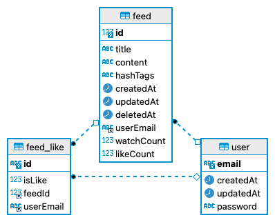

# 04-SNS

- SNS 서비스
  - 사용자는 본 서비스에 접속하여, 게시물을 업로드 하거나 다른 사람의 게시물을 확인하고, 좋아요를 누를 수 있습니다.

## 🔖 목차

- [04-SNS](#04-sns)
  - [🔖 목차](#-목차)
  - [💿 기술 스택](#-기술-스택)
  - [💾 ERD 설계](#-erd-설계)
  - [🚀 API 항목](#-api-항목)
    - [**🚶🏻 User**](#-user)
    - [**📋 Feed**](#-feed)
    - [**📋 Auth**](#-auth)
  - [🌕 프로젝트 실행 및 테스트](#-프로젝트-실행-및-테스트)

<br />

## 💿 기술 스택

---

<br>
<div align='center'> 🖥&nbsp&nbsp&nbsp사용한 기술 스택</div>
<br>
<p align="center">
📑&nbsp&nbsp&nbsp구성 언어
  </p>
<p align="center">

  </p>
 <p align="center">
🏠&nbsp&nbsp&nbsp Database
  </p>
<p align="center">

&nbsp&nbsp&nbsp 


  </p>
<p align="center">
🏖&nbsp&nbsp&nbsp 서버
  </p>
<p align="center">

&nbsp&nbsp

&nbsp&nbsp

&nbsp&nbsp

</p>

---

<br>

## 💾 ERD 설계



## 🚀 API 항목

<br>

### **🚶🏻 User**

|  METHOD  |                URL                |                             PARAMETER                              |                        RETURN                         |          DESCRIPTION           |
| :------: | :-------------------------------: | :----------------------------------------------------------------: | :---------------------------------------------------: | :----------------------------: |
| **GET**  | http://localhost:3003/api/v1/user |      [CurrentUser](./backend/src/common/auth/currentUser.ts)       | [User](backend/src/apis/user/entities/user.entity.ts) | 자신의 유저 정보를 조회합니다. |
| **POST** | http://localhost:3003/api/v1/user | [CreateUserInput](./backend/src/apis/user/dto/createUser.input.ts) | [User](backend/src/apis/user/entities/user.entity.ts) |       유저를 생성합니다.       |

 <div><details><summary>내 유저 정보 조회</summary>
 <div markdown="1">
 
 </div></details></div>

 <div><details><summary>회원가입(유저 정보 생성)</summary>
 <div markdown="1">
 

 </div></details></div>

<hr>
<br>

### **📋 Feed**

|   METHOD   |                    URL                     |                                 PARAMETER                                  |                              RETURN                              |          DESCRIPTION           |
| :--------: | :----------------------------------------: | :------------------------------------------------------------------------: | :--------------------------------------------------------------: | :----------------------------: |
|  **POST**  |     http://localhost:3003/api/v1/feed/     |     [CreateFeedInput](./backend/src/apis/feed/dto/createFeed.input.ts)     |     [Feed](./backend/src/apis/feed/entities/feed.entity.ts)      |      게시글을 생성합니다.      |
|  **GET**   | http://localhost:3003/api/v1/feed/{feedId} |                                   feedId                                   |     [Feed](./backend/src/apis/feed/entities/feed.entity.ts)      | 게시글을 단일 상세 조회합니다. |
|  **GET**   |     http://localhost:3003/api/v1/feed/     |              ?search,?order,?orderBy,?filter,?page,?pageCount              | [FetchFeedOutput](backend/src/apis/feed/dto/fetchFeed.output.ts) | 게시글 목록을 검색 조회합니다. |
| **PATCH**  | http://localhost:3003/api/v1/feed/{feedId} | feedId, [UpdateFeedInput](./backend/src/apis/feed/dto/updateFeed.input.ts) |     [Feed](./backend/src/apis/feed/entities/feed.entity.ts)      |      게시글을 수정합니다.      |
| **DELETE** | http://localhost:3003/api/v1/feed/{feedId} |                                   feedId                                   |           String('게시글이 성공적으로 삭제되었습니다')           |      게시글을 삭제합니다.      |
|  **PUT**   | http://localhost:3003/api/v1/feed/{feedId} |                                   feedId                                   |           String('게시글이 성공적으로 복구되었습니다')           |  삭제된 게시글을 복구합니다.   |
|  **POST**  |     http://localhost:3003/api/v1/feed/     |                                   feedId                                   |         String('좋아요 성공),String('좋아요 취소 성공')          |  게시글에 좋아요를 누릅니다.   |

<hr>

 <div><details><summary>게시글 생성</summary>
 <div markdown="1">
 
  
 </div></details></div>

 <div><details><summary>게시글 수정</summary>
 <div markdown="1">


 </div></details></div>

  <div><details><summary>게시글 삭제</summary>
 <div markdown="1">
 


 </div></details></div>

   <div><details><summary>게시글 복구</summary>
 <div markdown="1">
 


  </div></details></div>

<div><details><summary>게시글 좋아요</summary>
 <div markdown="1">
 


 </div></details></div>

 <div><details><summary>게시글 목록 검색 조회</summary>
<div markdown="1">

<div><details><summary>맛집 검색</summary>
<div markdown="1">
 


</div></details></div>

<div><details><summary>여행 검색</summary>
<div markdown="1">


</div></details></div>

 </div></details></div>

<div><details><summary>게시글 상세 조회</summary>
 <div markdown="1">
 


 </div></details></div>

 <div><details><summary>게시글 상세 조회시 조회수 증가</summary>
 <div markdown="1">
 


 </div></details></div>

<hr>
<br>

### **📋 Auth**

|  METHOD  |                       URL                       |                        PARAMETER                         |       RETURN        |   DESCRIPTION    |
| :------: | :---------------------------------------------: | :------------------------------------------------------: | :-----------------: | :--------------: |
| **POST** |       http://localhost:3003/api/v1/login        | [loginInput](./backend/src/apis/auth/dto/login.input.ts) | String(액세스 토큰) |      로그인      |
| **POST** | http://localhost:3003/api/v1/restoreAccessToken |                            -                             | String(액세스 토큰) | 액세스 토큰 복구 |

 <div><details><summary>로그인</summary>
 <div markdown="1">
 


 </div></details></div>

  <div><details><summary>액세스 토큰 복구</summary>
 <div markdown="1">
 


 </div></details></div>

 <br>

---

<br>

## 🌕 프로젝트 실행 및 테스트

**1. 실행 방법** 💡

- local 실행시 명령어

```
git clone https://github.com/pre-onboarding-backend-E/04-SNS
git checkout taeyoung
cd backend
docker compose build
docker compose up
```

**2. API 테스트 방법** 💡

- local
  - http://localhost:3003/api/docs
  <!-- - deployed server
  - http://3.39.69.233/api/hello - 배포 서버 링크 -->

**3. Swagger 테스트 방법** 💡

- local
  - http://localhost:3003/api/docs 접속
  <!-- - deployed server
  - http://3.39.69.233/api/docs 접속 - 배포 서버 링크 ( 스웨거 ) -->

 <!-- **4. TDD** 💡 -->
