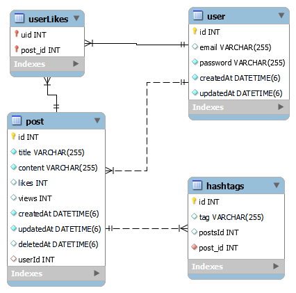
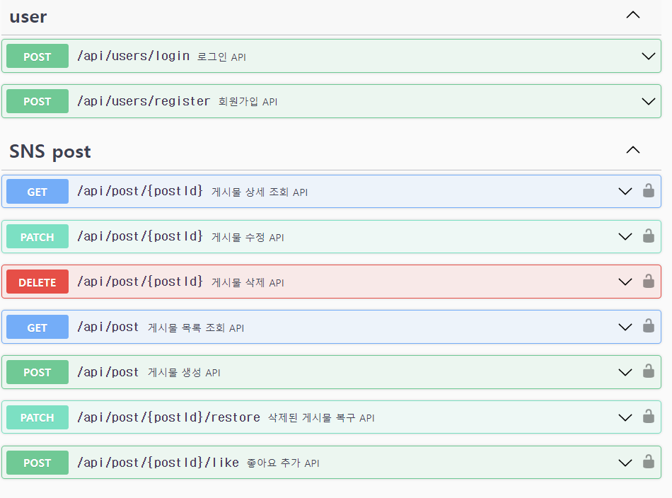

# 04-SNS-project / sns-service

## 목차

- [🔎 프로젝트 개요](#🔎-프로젝트-개요)
- [🌱 기술 스택](#🌱-기술-스택)
- [📝 ETC](#📝-ETC)
- [✨ 프로젝트 실행 및 테스트](#✨-프로젝트-실행-및-테스트)
- [✅요구사항 분석](#✅-요구사항-분석)
  - [A. sns user (사용자)](#a-sns-user-(사용자))
  - [B. sns post (게시물)](#B-sns-post-(게시물))

<br />

### 🔎 프로젝트 개요
  <br/> 
   주제 : SNS(Social Networking service) 서비스 

  - 사용자는 본 서비스에 접속하여 로그인 / 게시물 업로드 / 게시물 조회 / 게시글 좋아요 등의 기능을 이용할 수 있습니다. <br />

  - 프로젝트 수행 기간 : 2022/07/20~07/25 

<br/>

### 🌱 기술 스택
<div aligin = "center">
<br>


<br />
</div>
<br></br>

### 📝 ETC

<details>
<summary>ERD</summary>
<div markdown="1">



</div>
</details>

<details>
<summary>Swagger Docs</summary>
<div markdown="1">



</div>
</details>

<details>
<summary>Code & Convention</summary>

- [Git Commit Convention](https://github.com/pre-onboarding-backend-E/03-BossRaid-E/wiki/Commit-Convention)

- Lint, Prettier 포맷팅 <br />
</details>
<br></br>

### ✨ 프로젝트 실행 및 테스트

**1. 실행 방법** :bulb:

- local에서 실행시 명령어

```bash
$ git clone https://github.com/pre-onboarding-backend-E/04-SNS
$ git checkout haneul
$ cd 04-SNS
$ docker compose build
$ docker compose up
```

**2. API 테스트 방법(Swagger API DOCS)** :bulb:

- local
  - http://localhost:3001/api/docs

**3. ENV** :bulb:

- /env/.env  (샘플 예시입니다.)

```
DB_HOST=database-server
DB_PORT=3307
DB_USERNAME=root
DB_PASSWORD=1234
DB_DATABASE=wantedsns
JWT_SECRET=secret
JWT_EXPIRES_IN=1d
```

<br />

### ✅ 요구사항 분석

### A. sns user (사용자)

| 기능     | method | url                                   |
| -------- | ------ | ------------------------------------- |
| 회원가입 | POST   | /api/users/register       |
| 로그인   | POST   | /api/users/login |

<br/>

* 회원 가입과 로그인은 email과 password를 입력받고 이를 jwt를 통해 인증하는 과정을 거칩니다. `access-Token`의 만료 기한은 env/.env에서 설정 가능하며 sample 기준으로 24h 입니다.
</br>  

### B. sns post (게시물)

| 기능               | method | url                                                                          |
| ------------------ | ------ | ---------------------------------------------------------------------------- |
| 게시물 생성        | POST   | api/post             |
| 게시물 목록 조회       | GET    |  api/post |
| 게시물 수정        | PATCH  |  api/post/{postId}              |
| 게시물 삭제        | DELETE |  api/post/{postId}        |
| 게시물 상세 조회   | GET    | api/post/{postId}       |
| 게시물 복구 | PATCH | api/post/{postId/restore} |
| 좋아요 💗   | POST   |  api/post/{postId/like}    |
<br/>

* 게시물 상세와 목록은 로그인한 `모든 유저`가 조회할 수 있습니다.

* 게시물의 수정/삭제/복구는 `해당 게시물의 작성자만` 할 수 있습니다. {postId} (게시물 번호)를 parameter로 해당 api를 사용합니다. 

* 게시물 상세 조회 시 조회 수가 증가합니다.

* 게시물 조회 시 키워드/해시태그 검색값은 기본적으로 공백으로 두며 n개의 경우 배열의 형태로 보내집니다. 

* 타인의 게시물에 좋아요를 추가할 수 있습니다.
