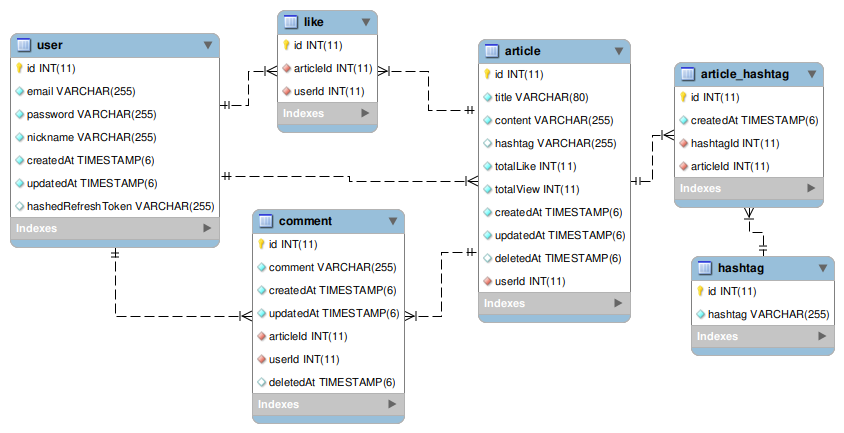
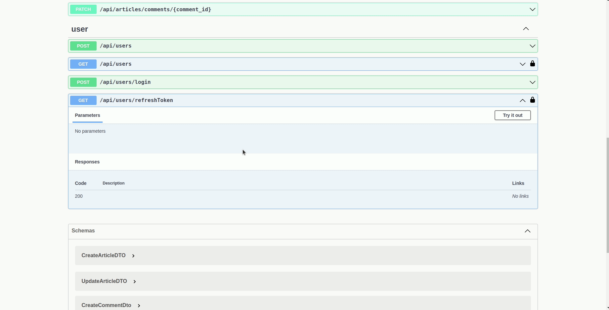

# 04-SNS-project :family:

## 목차

- [😃 프로젝트 개요](#😃-프로젝트-개요)
- [:cd: 기술 스택](#cd-기술-스택)
- [🌵 ETC](#🌵-etc)
- [:full_moon: 프로젝트 실행 및 테스트](#fullmoon-프로젝트-실행-및-테스트)
- [🤹🏼‍♂️ 요구사항](#🤹🏼‍♂️-요구사항)
  - [A. 유저 관리](#a-유저-관리)
  - [B. 게시글](#b-게시글)
- [:full_moon: 프로젝트 실행 및 테스트](#fullmoon-프로젝트-실행-및-테스트)

<br />

### 😃 프로젝트 개요

SNS(Social Networking service) 서비스 입니다.

사용자는 본 서비스에 접속하여 게시물을 업로드 하거나, 다른 사람의 게시물을 확인할 수 있습니다.
게시글에 좋아요를 누를 수 있습니다.
<br />

#### :cd: 기술 스택


<br />

### 🌵 ETC

<details>
<summary>ERD</summary>
<div markdown="1">



</div>
</details>

<details>
<summary>Git Commit Convention</summary>
<div markdown="1">

- ADD / 기능 신규 개발
- MODIFY / 기존 기능 수정
- REFACTOR / 기존 기능 개선
- FIX / 버그 픽스
- REMOVE / 불필요한 로직 제거
- DOCS / 문서 작업
- COMMENT / 코드 리뷰 반영 결과
- git issue 관련 내용 상세

  ```bash
  ADD / 00기능을 구현하였습니다.

  00기능을 구현하였습니다.
  ~~ 코드를 수정하였습니다.

  Resolve: #00
  Ref: #00
  Relate to: #00
  ```

  - Resolve: #이슈 넘버 (이슈를 해결함)
  - Ref: #이슈 넘버 (이슈 참고)
  - Relate to: #이슈 넘버 (관련된 이슈)

- CHORE / 기타 작은 사항들. 패키지 설치 등
</div>
</details>

- Docker & GCP를 이용한 배포: http://34.64.79.27:3000/api/docs/
- Lint, Prettier 포맷팅
  <br />

### :full_moon: 프로젝트 실행 및 테스트

**1. 실행 방법** :bulb:

- local에서 실행시 명령어

```bash
$ git clone https://github.com/pre-onboarding-backend-E/04-SNS
$ git checkout shinyeong
$ cd app
$ docker compose build
$ docker compose up
```

**2. API 테스트 방법(Swagger API DOCS)** :bulb:

- 배포 링크
  - http://34.64.79.27:3000/api/docs/
- local
  - http://localhost:3000/api/docs

**:bulb: ENV**

- 위치: /env/.env
- local에서 실행시 샘플로 사용할 env는 다음과 같습니다

```
DB_HOST=database-server
DB_PORT=3309
DB_USERNAME=root
DB_PASSWORD=1111
DB_DATABASE=sns
JWT_SECRET_KEY=TestSecretKey
JWT_EXPIRATION_TIME=15m
JWT_REFRESH_TOKEN_SECRET=RefreshTokenSecretTest
JWT_REFRESH_TOKEN_EXPIRATION_TIME=30d
```

<br />

### 🤹🏼‍♂️ 요구사항

#### A. 유저 관리

| 기능           | method | url                                   |
| -------------- | ------ | ------------------------------------- |
| 회원가입       | POST   | http://localhost:3000/api/users       |
| 로그인         | POST   | http://localhost:3000/api/users/login |
| 유저 정보 조회 | GET    | http://localhost:3000/api/users       |

<details>
<summary>회원가입</summary>
<div markdown="1">

- 이메일, 비밀번호, 비밀번호 확인, 닉네임을 입력받습니다.
- 이미 사용 중인 이메일은 사용할 수 없습니다.
- Body

```js
{
  "email": "test@mail.com", // 이메일
  "password": "password1234", // 비밀번호
  "confirmPassword": "password1234", // 비밀번호 확인
  "nickname": "한글nickname123", // 닉네임
}
```


</div>
</details>
<details>
<summary>로그인</summary>
<div markdown="1">

- 로그인은 비밀번호와 이메일을 입력받습니다.
- 로그인 요청에 성공하면 `accessToken`과 `refreshToken`을 쿠키로 전달합니다.
  - `accessToken` 유효시간: 15m
  - `refreshToken` 유효시간: 30d
- Body

```js
{
  "email": "test@mail.com", // 이메일
  "password": "password1234" // 비밀번호
}
```


</div>
</details>
<details>
<summary>유저 정보 조회</summary>
<div markdown="1">

- 요청 시 쿠키에 유효한 `accessToken`이 있어야 합니다.
- 응답으로 password와 refreshToken을 제외한 다른 유저 정보가 리턴됩니다.

</div>
</details>
<details>
<summary>token 재발급</summary>
<div markdown="1">

- 요청 시 쿠키에 유효한 `refreshToken`이 있어야 합니다.
  

</div>
</details>

:pushpin: 로그아웃은 프론트엔드에서 처리합니다.

<br />

#### B. 게시글

| 기능                    | method | url                                                                          |
| ----------------------- | ------ | ---------------------------------------------------------------------------- |
| 게시글 생성             | POST   | http://localhost:3000/api/articles                                           |
| 게시글 수정             | PATCH  | http://localhost:3000/api/articles/:id                                       |
| 게시글 삭제             | DELETE | http://localhost:3000/api/articles/:id                                       |
| 게시글 상세보기         | GET    | http://localhost:3000/api/articles/:id                                       |
| 게시글 목록             | GET    | http://localhost:3000/api/articles/?search,order,orderBy,limit,offset,filter |
| 게시글 좋아요           | POST   | http://localhost:3000/api/articles/like/:id                                  |
| 게시글 좋아요 취소      | DELETE | http://localhost:3000/api/articles/like/:id                                  |
| 게시글 좋아요 목록 요청 | GET    | http://localhost:3000/api/articles/like/:id                                  |
| 게시글 댓글 생성        | POST   | http://localhost:3000/api/articles/comments/:id                              |
| 게시글 댓글 수정        | PATCH  | http://localhost:3000/api/articles/comments/:comment_id                      |
| 게시글 댓글 삭제        | DELETE | http://localhost:3000/api/articles/comments/:comment_id                      |

<details>
<summary>게시글 생성</summary>
<div markdown="1">

- 로그인 한 유저만 게시글을 생성할 수 있습니다.
- 제목, 내용, 해시태그 등을 입력하여 생성합니다.
- 해시태그는 `#`으로 시작하고, `,`로 구분되는 텍스트가 입력됩니다.
- Body

```jsx
{
  "title": "NestJS로 게시판 만들기!",
  "content": "오늘은 Nest js로 게시판을 만들어보겠습니다! blah blah",
  "hashtag": "#공부,#주말,#JS,#Nest JS,#프로젝트"
}
```


</div>
</details>
<details>
<summary>게시글 수정</summary>
<div markdown="1">

- 게시글 작성자만 수정을 요청할 수 있습니다.
- title, content, hashtag 중 수정이 필요한 부분만 요청합니다.
- Body

```jsx
{
  "title": "NestJS로 게시판 만들기!",
  "content": "오늘은 Nest js로 게시판을 만들어보겠습니다! blah blah",
  "hashtag": "#공부,#주말,#JS,#Nest JS,#프로젝트"
}
```


</div>
</details>
<details>
<summary>게시글 삭제</summary>
<div markdown="1">

- 파라미터로 삭제할 article id를 전달합니다.
  

</div>
</details>
<details>
<summary>게시글 상세보기</summary>
<div markdown="1">

- 모든 사용자가 게시물 상세 내용을 볼 수 있습니다.
- 제목, 내용, 해시태그, 좋아요 수, 조회수, 생성일, 작성자를 요청합니다.
- 상세 보기 요청을 보낼 시 조회수가 증가합니다.
  

</div>
</details>
<details>
<summary>게시글 목록</summary>
<div markdown="1">

- 게시글 목록을 요청합니다.
- **Pagination**: Query 파라미터로 `limit`과 `offset`을 전달합니다.(Optional)
  - `limit`: 불러올 게시글의 수
  - `offset`: 게시글을 어디서부터 가져올지. 0이면 처음부터 받아옵니다.
- **Order**: 오름차순 혹은 내림차순으로 정렬합니다.(Optional)
  - `ACS`: 오름차순
  - `DESC`: 내림차순
- **OrderBy**: 어떤 기준으로 정렬할지 결정합니다. (Optional)
  - `CREATEDAT`: 생성일자 순으로 정렬합니다.
  - `TOTALLIKE`: 좋아요 수 순으로 정렬합니다.
  - `TOTALVIEW`: 조회수 순으로 정렬합니다
    
- **Search**: 검색어를 포함하는 게시물을 찾습니다.
  - 제목 혹은 내용에 검색어가 포함되어 있어야합니다.
    
- **Filter**: 해시태그를 포함하는 게시물을 찾습니다.
  - ex) `서울,맛집`
    서울 혹은 맛집을 포함하는 게시물을 리턴합니다.
- 게시글 각각의 제목, 작성자, 해시태그, 작성일, 좋아요 수, 조회수가 포함됩니다.
- 모든 사용자가 볼 수 있습니다.
  

</div>
</details>
<details>
<summary>게시글 좋아요 요청</summary>
<div markdown="1">

- 각 유저는 작성자를 포함해서 좋아요 요청을 한번만 할 수 있습니다.
- 파라미터로 articleId를 전달합니다.
- 로그인 한 유저만 좋아요 요청을 할 수 있습니다.
  

</div>
</details>
<details>
<summary>게시글 좋아요 취소</summary>
<div markdown="1">

- 각 유저는 게시물에 대한 좋아요 취소 요청을 할 수 있습니다.
- 파라미터로 articleId를 전달합니다.
- 로그인 한 유저만 좋아요 요청을 취소 할 수 있습니다.
  

</div>
</details>
<details>
<summary>게시글 좋아요 목록 요청</summary>
<div markdown="1">

- 각 게시글에 좋아요를 누른 사람들의 목록을 요청합니다.
  

</div>
</details>
<details>
<summary>게시글 댓글 생성 </summary>
<div markdown="1">

- 각 게시글에 댓글을 생성할 수 있습니다.
- 로그인 한 유저만 댓글을 생성할 수 있습니다.
  

</div>
</details>
<details>
<summary>게시글 댓글 수정 </summary>
<div markdown="1">

- 자신이 작성한 댓글을 수정할 수 있습니다.

</div>
</details>

<details>
<summary>게시글 댓글 삭제</summary>
<div markdown="1">

- 자신이 작성한 댓글을 삭제할 수 있습니다.

</div>
</details>

<br />
