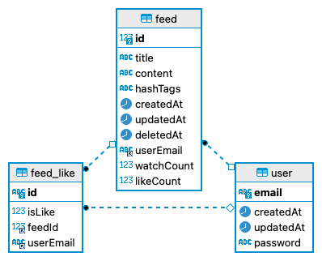

# 04-SNS

- SNS 서비스
  - 사용자는 본 서비스에 접속하여, 게시물을 업로드 하거나 다른 사람의 게시물을 확인하고, 좋아요를 누를 수 있습니다.

## 🔖 목차

- [04-SNS](#04-sns)
  - [🔖 목차](#-목차)
  - [🌩 프로젝트 상세](#-프로젝트-상세)
  - [🚀 프로젝트 실행 및 테스트](#-프로젝트-실행-및-테스트)
  - [💻 기술 스택](#-기술-스택)
  - [🚀 API 항목](#-api-항목)
    - [**🚶🏻 User**](#-user)
    - [**📋 Feed**](#-feed)
    - [**📋 Auth**](#-auth)
  - [💾 ERD 설계](#-erd-설계)
  - [🔒 ENV](#-env)

<br>

## 🌩 프로젝트 상세

1. 로그인

   - 로그인 시 액세스 토큰이 발급되며 헤더에 리프레시 토큰이 쿠키에 저장됩니다
   - 발급된 액세스 토큰을 통해 사용자 인증을 진행합니다
   - 사용자 인증이 필요한 API는 다음과 같습니다
     - 유저 조회
     - 액세스 토큰 재발급(복구) : 쿠키에 유지되는 리프레시 토큰을 이용합니다
     - 게시글 생성, 수정, 삭제, 복구, 좋아요

2. 유저 관리

   - 이메일을 PK로 사용하며 password는 bcrypt를 통해 암호화된 상태로 DB에 저장됩니다

3. 게시글 생성, 수정, 삭제, 복구

   - TypeOrm을 통해 MySQL DB에 관련 정보가 저장됩니다
   - 게시글 생성 시 별도의 테이블을 만들지 않고 해시태그가 #가 붙은 문자열의 모음으로 저장됩니다.(ex) `#태그`)

4. 게시글 상세 조회

   - 게시글 조회시 CQRS 쿼리버스를 통해 게시글의 조회수가 증가합니다

5. 게시글 리스트 검색 조회

- 다음과 같은 쿼리 파라미터들을 이용해 검색합니다
- `search` : 게시글 제목 혹은 본문을 검색합니다 `like` SQL문과 와일드카드(`%`)를 이용해 검색합니다
- `filter` : 해시태그 수만큼 TypeORM 쿼리빌더를 통해 `like` SQL문과 와일드카드(`%`)를 이용해 검색합니다
- `sort` & `order` :
  - `sort`:생성일, 조회수, 좋아요 수 중 어떤 기준으로 정렬할지 정합니다 ( default : 생성일 )
  - `order`: 오름차순으로 정렬할지 내림차순으로 정렬할지 정합니다 ( default : 내림차순 )
- `page` & `pageCount` :
  - `page` : 몇번째 페이지를 조회할지 정합니다 ( default : 1 )
  - `pageCount` : 한 페이지당 조회될 게시글 수를 정합니다 ( default : 10 )

6. TDD

- service.ts의 단위 테스트 진행
- 3개의 서비스파일에서 42개의 유닛 테스트 진행
  - auth service
    - 검증 테스트 : 6개
  - feed service
    - 검증 테스트 : 21개
    - 에러 테스트 : 8개
  - user service
    - 검증 테스트 : 5개
    - 에러 테스트 : 2개

<br>

---

## 🚀 프로젝트 실행 및 테스트

**💡 배포 서버에서 테스트**

- RestApi로 테스트하기

  - localhost => sns.leo3179.shop
  - [Api 항목](#-api-항목)을 참고하여 Rest-Api 호출

- Swagger Docs에서 테스트하기
  - http://sns.leo3179.shop/api/docs

<br>

**💡 local에서 테스트**

```
- 실행 명령어
git clone https://github.com/pre-onboarding-backend-E/04-SNS
git checkout taeyoung
cd backend
# env/.env 추가
docker compose build
docker compose up
```

- RestApi로 테스트하기

  - [Api 항목](#-api-항목)을 참고하여 Rest-Api 호출

- Swagger Docs에서 테스트하기
  - http://localhost:3003/api/docs

---

## 💻 기술 스택

<br>
<div align='center'> 🖥&nbsp&nbsp&nbsp사용한 기술 스택</div>
<br>
<p align="center">
📑&nbsp&nbsp&nbsp구성 언어
  </p>
<p align="center">
  

  </p>
 <p align="center">
💾&nbsp&nbsp&nbsp 데이터
  </p>
<p align="center">
  
   
  </p>
<p align="center">
  🚂  &nbsp&nbsp 서버

  </p>
<div align="center">
  
  
   
  

</div>

<div align="center">
🚀&nbsp&nbsp&nbsp 배포
<br>
     
</div>

---

<br>

## 🚀 API 항목

<br>

### **🚶🏻 User**

|  METHOD  |                URL                |                             PARAMETER                              |                        RETURN                         |          DESCRIPTION           |
| :------: | :-------------------------------: | :----------------------------------------------------------------: | :---------------------------------------------------: | :----------------------------: |
| **GET**  | http://localhost:3003/api/v1/user |      [CurrentUser](./backend/src/common/auth/currentUser.ts)       | [User](backend/src/apis/user/entities/user.entity.ts) | 자신의 유저 정보를 조회합니다. |
| **POST** | http://localhost:3003/api/v1/user | [CreateUserInput](./backend/src/apis/user/dto/createUser.input.ts) | [User](backend/src/apis/user/entities/user.entity.ts) |       유저를 생성합니다.       |

[회원가입/유저정보 생성](image/gif/회원가입.gif)

<hr>
<br>

### **📋 Feed**

|   METHOD   |                    URL                     |                                 PARAMETER                                  |                              RETURN                              |          DESCRIPTION           |
| :--------: | :----------------------------------------: | :------------------------------------------------------------------------: | :--------------------------------------------------------------: | :----------------------------: |
|  **POST**  |     http://localhost:3003/api/v1/feed/     |     [CreateFeedInput](./backend/src/apis/feed/dto/createFeed.input.ts)     |     [Feed](./backend/src/apis/feed/entities/feed.entity.ts)      |      게시글을 생성합니다.      |
|  **GET**   | http://localhost:3003/api/v1/feed/{feedId} |                                   feedId                                   |     [Feed](./backend/src/apis/feed/entities/feed.entity.ts)      | 게시글을 단일 상세 조회합니다. |
|  **GET**   |     http://localhost:3003/api/v1/feed/     |              ?search,?order,?orderBy,?filter,?page,?pageCount              | [FetchFeedOutput](backend/src/apis/feed/dto/fetchFeed.output.ts) | 게시글 목록을 검색 조회합니다. |
| **PATCH**  | http://localhost:3003/api/v1/feed/{feedId} | feedId, [UpdateFeedInput](./backend/src/apis/feed/dto/updateFeed.input.ts) |     [Feed](./backend/src/apis/feed/entities/feed.entity.ts)      |      게시글을 수정합니다.      |
| **DELETE** | http://localhost:3003/api/v1/feed/{feedId} |                                   feedId                                   |           String('게시글이 성공적으로 삭제되었습니다')           |      게시글을 삭제합니다.      |
|  **PUT**   | http://localhost:3003/api/v1/feed/{feedId} |                                   feedId                                   |           String('게시글이 성공적으로 복구되었습니다')           |  삭제된 게시글을 복구합니다.   |
|  **POST**  |     http://localhost:3003/api/v1/feed/     |                                   feedId                                   |         String('좋아요 성공),String('좋아요 취소 성공')          |  게시글에 좋아요를 누릅니다.   |

[게시글 생성](image/gif/게시글%20생성.gif)

[게시글 수정](image/gif/게시글%20수정.gif)

[게시글 삭제](image/gif/게시글%20삭제.gif)

[게시글 복구](image/gif/게시글%20복구.gif)

[게시글 좋아요](image/gif/게시글%20좋아요.gif)

[맛집 검색](image/gif/맛집%20검색.gif)

[여행 검색](image/gif/여행%20검색.gif)

[게시글 상세 조회](image/gif/게시글%20상세조회1.gif)

[게시글 상세조회시 조회수 증가 구현](image/gif/게시글%20상세조회2.gif)

<hr>
<br>

### **📋 Auth**

|  METHOD  |                       URL                       |                        PARAMETER                         |       RETURN        |   DESCRIPTION    |
| :------: | :---------------------------------------------: | :------------------------------------------------------: | :-----------------: | :--------------: |
| **POST** |       http://localhost:3003/api/v1/login        | [loginInput](./backend/src/apis/auth/dto/login.input.ts) | String(액세스 토큰) |      로그인      |
| **POST** | http://localhost:3003/api/v1/restoreAccessToken |                            -                             | String(액세스 토큰) | 액세스 토큰 복구 |

[로그인](image/gif/로그인.gif)

[액세스 토큰 복구](image/gif/액세스%20토큰%20복구.gif)

---

<br>

## 💾 ERD 설계



<br>

## 🔒 ENV

- 위치 : /env/.env
- local에서 실행시 샘플로 사용할 env는 다음과 같습니다

```
DB_HOST=database-server
DB_PORT=3306
DB_USERNAME=root
DB_PASSWORD=1178
DB_DATABASE=sns
JWT_ACCESS_KEY=AK
JWT_REFRESH_KEY=RK
JWT_ACCESS_EXPIRATION_TIME=5h
JWT_REFRESH_EXPIRATION_TIME=10h
ALLOW_ORIGIN_URL=http://localhost:3003
```
